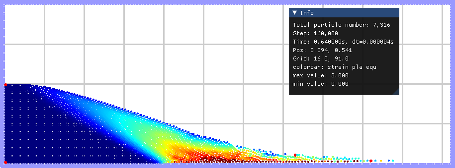

# tiSPHi: from 0.1 to 1

<div align="center">
  
</div>

## News

**NEW**! SORRY BUT IT CANNOT RUN NOW!

## Background

Reseach topic: SPH based simulation of ground behaviour in geotechnics.

## Sources

### Code

1. [taichiCoourse01, wcsph code by Mingrui Zhang](https://github.com/erizmr/SPH_Taichi)
2. [Stress Particle SPH (in Fortran)](https://github.com/CaitlinChalk/Stress-Particle-SPH)
3. [SPlisHSPlasH](https://github.com/InteractiveComputerGraphics/SPlisHSPlasH)

### Literatures

1. Aiming to reinplement (Chalk 2020): [Stress-Particle Smoothed Particle Hydrodynamics: An application to the failure and post-failure behaviour of slopes](https://doi.org/10.1016/j.cma.2020.113034)
2. Chalk PhD thesis2019 (included in [GitHub](https://github.com/CaitlinChalk/Stress-Particle-SPH))
3. Bui 2021: [Smoothed particle hydrodynamics (SPH) and its applications in geomechanics: From solid fracture to granular behaviour and multiphase flows in porous media](https://doi.org/10.1016/j.compgeo.2021.104315)
4. Yang 2021: [Numerical investigation of the mechanism of granular flow impact on rigid control structures](https://doi.org/10.1007/s11440-021-01162-4)
5. Bui 2008: [Lagrangian meshfree particles method (SPH) for large deformation and failure flows of geomaterial using elastic-plastic soil constitutive model](https://doi.org/10.1002/nag.688)

## Runtime

### Requirements

* taichi >= 1.0.0
* numpy

### Run

With changing paras in `draft0.py`, you can simulate a simple sand column collapse.
* `world`: physical world boundary, m.
* `particle_radius`: radius of discretisation.
* `cube_size`: Width and height of sand column.

### Hot key

* `SPACE`: control the pause/run of simulation
* `ESC`: stop and exit the simulation
* `P`: make a screenshot and save to the folder "screenshots"
* `Left mouse click`: click in a position to show the coordinate and grid index.

## Presentation

### Water

### Sand

Result of a simple sand column collapse (colored by equivalent plastic strain):



## Project structure

```
-|data            --something from somewhere in sometime
-|docs            --mkdocs: learning note of tiSPHi
-|eng             --code for engine
---__init__.py
---colormap.py
---gguishow.py
---particle_system.py
---sph_solver.py
---wcsph.py
---muIsph.py
-|tests           --code for tests
-LICENSE
-README.MD
-mkdocs.yml       --use `mkdocs serve` to read the doc
-draft0.py        --simulation draft
-Hint.py          --record some thinkings and problems while programming
```

## Details

### Code

In a basic code frame of wcsph from Mingrui Zhang in taichiCourse01, add the following points (for most details, please read the docs):
* `Dummy particles`: based on `add_cube` functions, not very good now
* Artificial velocity in dummy nodes
* Using GGUI to show the simulation
* Color theme: jet, bwr, mycoolwarm
* Wendland C2 kernel
* Normalisation to achieve a second order accuracy for anti-symmetric form SPH formula of gradient approximation
* 2nd order Leap-Frog and 4th order Rounge-Kutta time integration

### Colormap


